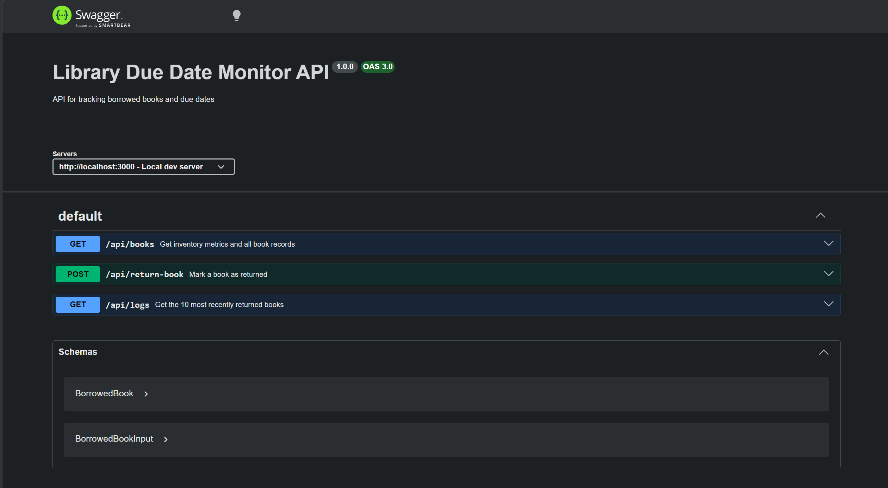

## Library Due Date Monitor Backend

## Architecture

The architecture is based on layered architecture approach of having controllers, repositories and models all separated and service layer being the head to talk to controllers.

## Endpoints Created

1. `GET`::`/api/books` = Get inventory metrics and all book records
2. `POST`::`/api/return-book` = Mark a book as returned
3. `GET`::`/api/logs` = Get the 10 most recently returned books

## Testing

`pnpm run test` for all three endpoints.

```bash
 PASS  test/app.test.js
  Library API Endpoints
    √ GET /api/books - returns list of books (116 ms)
    √ GET /api/logs - returns activity logs (11 ms)
    √ POST /api/return-book - returns a book (25 ms)

Test Suites: 1 passed, 1 total
Tests:       3 passed, 3 total
Snapshots:   0 total
Time:        1.348 s, estimated 2 s
Ran all test suites.
```

## Swagger Dashboard 

Accessible at `/api-docs`.



## DB

SQLite is used. Drizzle is the chosen ORM.

### Scripts:

1. `db:seed` = Seed 75 books to the db `borrowed_books` schema.
2. `db:clear` = Clear all db seeded books.

# TO RUN

```bash
pnpm install # Install all dependencies

pnpm run dev
```

The backend runs at `localhost:3000`
