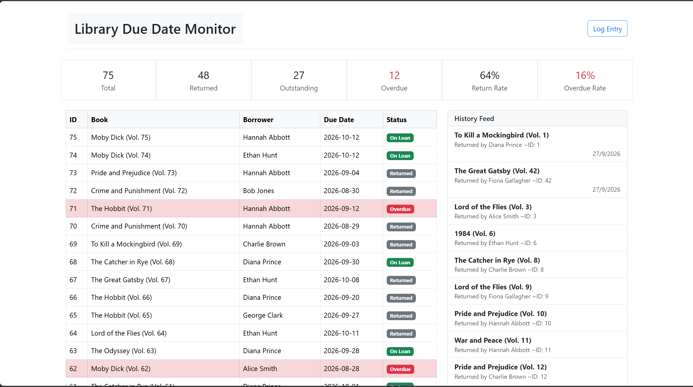

# Library Due Date Monitor Frontend

## Architecture

It is a single page application. Vue's `ref` based reactive state management is used. The `client.js` file is responsible for fetching data from the backend.



Uses bootstrap for styling from the cdn.

# TO RUN

```bash
pnpm install # To instal all the dependencies

pnpm run dev 
```

The website is accessible at `localhost:5173`.